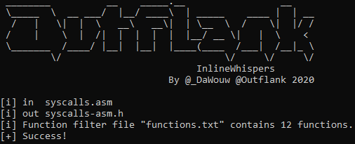

# InlineWhispers #
A Proof of Concept for weaponizing [SysWhispers](https://github.com/jthuraisamy/SysWhispers) for making [direct system calls](https://outflank.nl/blog/2019/06/19/red-team-tactics-combining-direct-system-calls-and-srdi-to-bypass-av-edr/) in Cobalt Strike [Beacon Object File](https://www.cobaltstrike.com/help-beacon-object-files).

The initial output (`functions.txt` and `syscalls-asm.h`) are created as an example for [WdToggle](https://github.com/outflanknl/WdToggle).

Additional guidance can be found in this blog post: https://outflank.nl/blog/?p=1592

Raphael Mudge (the creator of Cobalt Strike) created a tutorial video on how to use this tool: https://www.youtube.com/watch?v=mZyMs2PP38w

### What is this repository for? ###

Demonstrate the ability to easily use syscalls using inline assembly in BOFs.

### How do I set this up? ###

 * (Optionally) Install [SysWhispers](https://github.com/jthuraisamy/SysWhispers)
    * `git clone https://github.com/jthuraisamy/SysWhispers.git `
    * `cd SysWhispers`
    * `pip3 install -r .\requirements.txt`
    * `py .\syswhispers.py --versions 7,8,10 -o syscalls` was used to generate the included `syscalls.asm` and `syscalls.h`.
 * Clone this repository.
 * Update which functions are required in `functions.txt` to include only necessary functions from syscalls.asm.
 * Run the ``python InlineWhispers.py`` command to generate the inline assembly (`syscalls-asm.h`) header file.
 * Remove function definitions in `Syscalls.h` that are not included.
 * Include `Syscalls.h` in your project.

 

### Limitations ###

 * The `Syscalls.h` header file provided includes many extern function definitions by default. This can lead to compilation without actually having the function included in your object (if not removed).
 * Inline assembly is only supported by Mingw-w64. Visual Studio does not support inline assembly.

### Credits ###

 * The assembly code used within this tool is based on the assembly output from the 
[SysWhispers](https://github.com/jthuraisamy/SysWhispers) tool from [@Jackson_T](https://twitter.com/Jackson_T).
 * All people credited for [SysWhispers](https://github.com/jthuraisamy/SysWhispers#credits)
